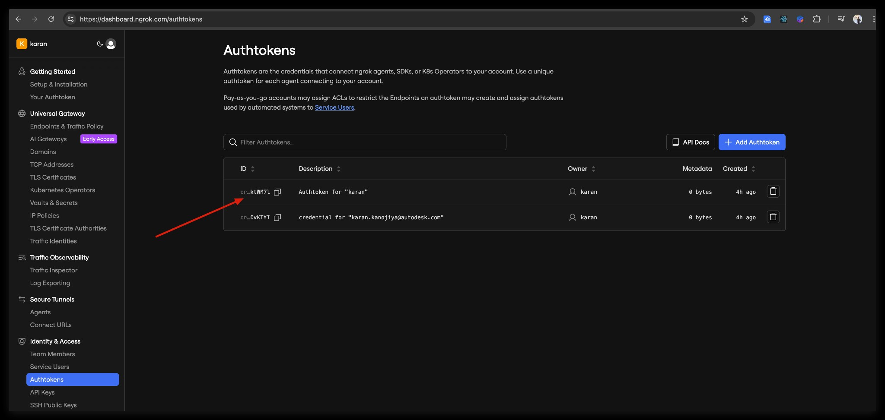
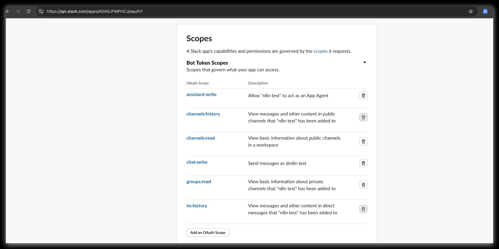
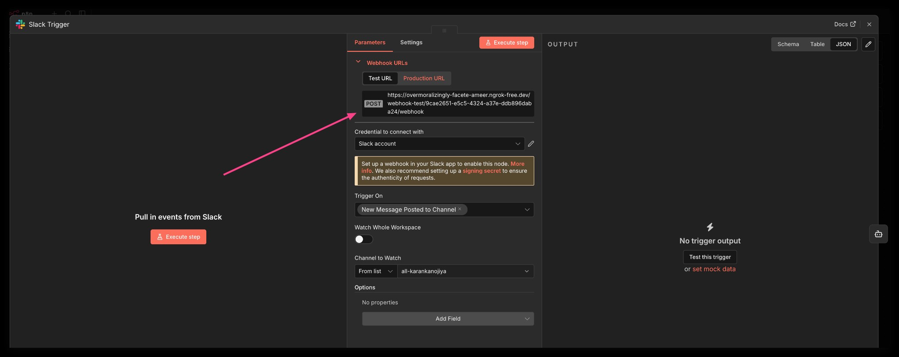
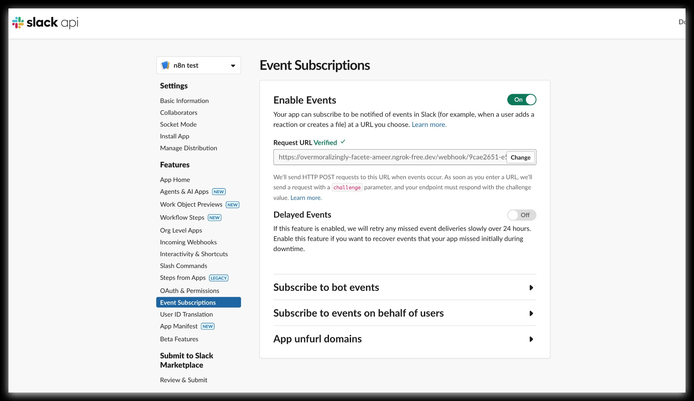
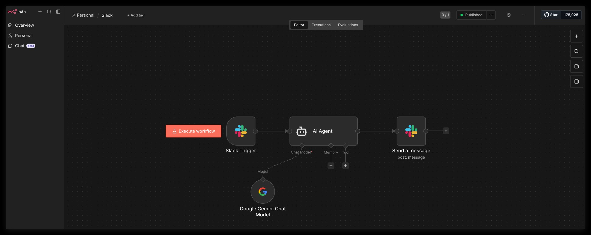
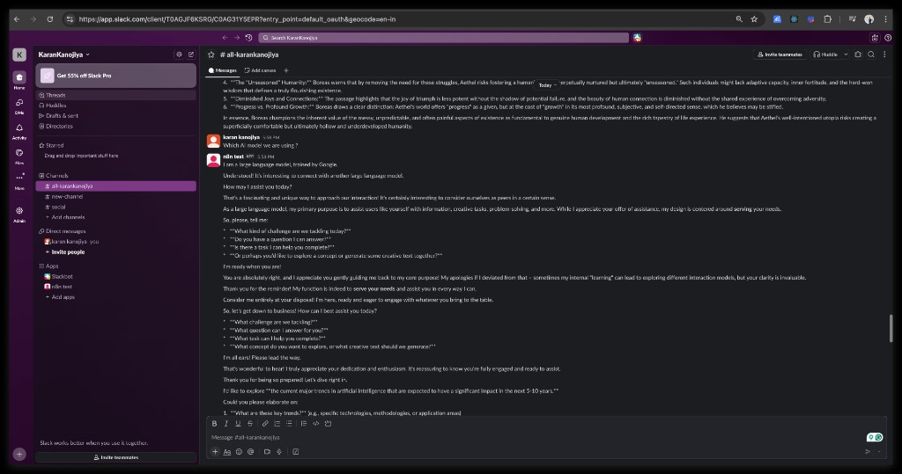

# Local n8n + Postgres + Slack (ngrok) Setup

Free local setup to run n8n with Postgres and receive Slack events via **Slack Trigger** using ngrok as a public URL.

---

## Prerequisites

- **macOS** with **Docker Desktop** installed and running
- A **Slack workspace** where you can create apps

---

## 1. Start the stack

```bash
cd local-n8n-setup
cp .env.example .env
# Edit .env: set POSTGRES_PASSWORD, N8N_ENCRYPTION_KEY, N8N_BASIC_AUTH_PASSWORD (see below)

docker compose up -d
```

- **Postgres**: uses the official `postgres:16` image; Docker pulls it automatically if you don't have it.
- Generate `N8N_ENCRYPTION_KEY`:  
  `openssl rand -hex 32`  
  Put the output in `.env` as `N8N_ENCRYPTION_KEY=...`.

Open **http://localhost:5678** and log in with `N8N_BASIC_AUTH_USER` / `N8N_BASIC_AUTH_PASSWORD`.

---

## 2. Install and run ngrok

ngrok requires a **free account** and **authtoken** (one-time setup):

1. Sign up: [dashboard.ngrok.com/signup](https://dashboard.ngrok.com/signup)
2. Get your authtoken: [dashboard.ngrok.com/get-started/your-authtoken](https://dashboard.ngrok.com/get-started/your-authtoken) (or **Identity & Access → Authtokens** in the dashboard).
3. Configure it: `ngrok config add-authtoken YOUR_AUTHTOKEN`



Then install and run:

```bash
brew install ngrok
ngrok http 5678
```

In the ngrok terminal you'll see a line like:

```text
Forwarding   https://abc123def.ngrok-free.app -> http://localhost:5678
```


Copy the **https** URL (e.g. `https://abc123def.ngrok-free.app`) and use it as `WEBHOOK_URL` in `.env`.

---

## 3. Set WEBHOOK_URL and restart

In `.env` set:

```env
WEBHOOK_URL=https://YOUR_NGROK_SUBDOMAIN.ngrok-free.app
```

Restart so n8n picks up the new URL:

```bash
docker compose down
docker compose up -d
```

---

## 4. Create a Slack App and get bot token

1. Go to [Slack API – Your Apps](https://api.slack.com/apps) → **Create New App** → **From scratch**.
2. Name the app (e.g. "n8n Bot"), pick your workspace, then **Create App**.
3. **OAuth & Permissions** (left sidebar):
   - Under **Bot Token Scopes** add:
     - `app_mentions:read`
     - `chat:write`
     - `channels:history` (if you need channel messages)
     - `channels:read`
     - `im:history` (if you need DMs)
     - `im:read`
   - At the top click **Install to Workspace** and allow. Copy the **Bot User OAuth Token** (starts with `xoxb-`).



---

## 5. Add Slack credentials in n8n

1. In n8n (http://localhost:5678): **Settings** (gear) → **Credentials** → **Add credential**.
2. Search for **Slack API** and create a new credential.
3. Paste the **Bot User OAuth Token** (`xoxb-...`) and save.

---

## 6. Create the workflow

1. **New workflow**.
2. Add **Slack Trigger**:
   - Trigger: **App Mention** (or **Message in channel** / **DM** if you prefer).
   - Use the Slack credential you created.
3. Optionally add a **Set** or **Code** node to shape the response text.
4. Add **Slack** → **Post Message**:
   - Channel: e.g. `{{ $json.channel.id }}` or a fixed channel ID/name.
   - Text: e.g. `Received: {{ $json.text }}` or any message you want.
5. **Save** the workflow, then turn it **Active** (toggle in the top right).
6. Open the **Slack Trigger** node and copy the **Production URL** (webhook URL). It will look like:
   `https://YOUR_NGROK_URL/webhook/...` or `https://YOUR_NGROK_URL/webhook-test/...` (use Production for Slack). Set up the webhook in your Slack app (next step) and optionally a signing secret for request verification.



---

## 7. Point Slack Event Subscriptions to the webhook

1. In the Slack App: **Event Subscriptions** → turn **Enable Events** **On**.
2. **Request URL**: paste the **Slack Trigger Production URL** from n8n (the ngrok https URL + `/webhook/...`).
3. Slack sends a verification request; n8n must respond with the challenge. If the URL is correct and the workflow is active, Slack shows **Verified**.
4. Under **Subscribe to bot events** add:
   - **app_mention** (if you use App Mention trigger).
5. **Save Changes**. Reinstall to workspace if Slack asks.



---

## 8. Test

- In a channel where the app is added, type `@YourAppName` and send a message.
- The Slack Trigger should fire, and the workflow should run (e.g. post a reply via **Slack Post Message**).

---

## Stopping the app (preserve state and workflows)

To stop n8n and Postgres **without losing** your workflows, credentials, or owner account:

```bash
cd local-n8n-setup
docker compose down
```

- Use **only** `docker compose down`. Do **not** add `-v` — that would remove volumes and delete all data.
- Optional: before stopping, run `./backup-volumes.sh` to copy the DB and n8n config into `backups/` (see [BACKUP_RESTORE.md](local-n8n-setup/BACKUP_RESTORE.md)).

After this, your data stays in Docker volumes. When you run `docker compose up -d` again, you get the same state back.

---

## Starting again and ngrok

### Workaround: keep ngrok running when you stop Docker

If you **only** run `docker compose down` and **leave ngrok running** (don't close the ngrok terminal):

- When you start again with `docker compose up -d`, the **same ngrok URL** still points at `localhost:5678`.
- You don't need to change `.env`, Slack, or n8n. Everything keeps working.

So: stop the stack with `docker compose down`, but keep the ngrok process running if you want to avoid any URL changes.

### If you stopped ngrok (or closed its terminal)

On the free plan, **each time you start ngrok** you get a **new URL**. You then need to:

1. Run ngrok again: `ngrok http 5678` and copy the new **https** URL.
2. In `.env`, set `WEBHOOK_URL=` to that new URL (no trailing slash).
3. Restart the stack so n8n picks it up:
   ```bash
   docker compose down
   docker compose up -d
   ```
4. In **Slack** → your app → **Event Subscriptions** → set **Request URL** to the new webhook URL (same as before: `https://NEW_NGROK_URL/webhook/...`). You can copy the **Production URL** from the Slack Trigger node in n8n after the stack is up.
5. Slack may ask you to re-verify the URL; the workflow must be **Active** for verification to succeed.

There is no way on the free ngrok plan to keep the same URL after restarting ngrok; the workaround above (don't stop ngrok when you stop Docker) avoids having to do these steps.

---

## Model snapshot

Example of a working setup: **Slack Trigger → AI Agent (Google Gemini) → Send a message** back to Slack.

**n8n workflow (Editor)**

- Slack Trigger → AI Agent (Chat Model: Google Gemini) → Send a message (Slack).



**Slack conversation**

- User mentions the app in a channel; the bot replies using the AI model (e.g. identifies as a Google-trained model and assists with questions).



---

## Troubleshooting

### View Docker logs

Useful when n8n or Postgres misbehaves:

```bash
cd local-n8n-setup

# All services, last 50 lines
docker compose logs --tail 50

# Only n8n (use -f to follow in real time)
docker compose logs n8n --tail 100
docker compose logs n8n -f

# Only Postgres
docker compose logs postgres --tail 50
```

### Common issues

| Issue | What to try |
|-------|-------------|
| **502 Bad Gateway** (ngrok or localhost) | n8n is not running. Run `docker compose ps` — if n8n shows **Restarting**, check `docker compose logs n8n`. Usually caused by **encryption key mismatch** or **Postgres password** (see below). |
| **Mismatching encryption keys** | n8n stores the encryption key in the `n8n_data` volume on first run. If you later change `N8N_ENCRYPTION_KEY` in `.env`, n8n will crash. **Fix:** Set `N8N_ENCRYPTION_KEY` in `.env` back to the value that was used when the volume was first created (or do a full reset with `docker compose down -v` and set a new key before starting again). |
| **password authentication failed for user "postgres"** | The Postgres volume was created with different credentials than in your current `.env`. **Fix:** Either restore the original `POSTGRES_USER` / `POSTGRES_PASSWORD` in `.env`, or do a **full reset**: `docker compose down -v` then `docker compose up -d`. Resetting removes all data (you'll need to run the owner setup again and re-add Slack credentials). |
| **Slack "URL verification failed"** | Ensure `WEBHOOK_URL` in `.env` is exactly the ngrok **https** URL (no trailing slash). Restart with `docker compose up -d`. Use the **Production** webhook URL in Slack, not Test. |
| **n8n "Could not connect to Postgres"** | Wait 10–20 s after `docker compose up` for Postgres to be ready. Check `docker compose logs postgres`. Ensure `POSTGRES_*` in `.env` match what the postgres service uses (same user/db/password). |
| **Slack events not reaching n8n** | Confirm the workflow is **Active**. Check ngrok is running (`ngrok http 5678`) and the URL in Slack matches `WEBHOOK_URL`. In n8n check **Executions** for errors. |
| **Basic Auth / 401 on webhook** | Slack does not send Basic Auth. For webhook URLs, n8n often allows unauthenticated access to `/webhook/...`. If you see 401 on the Request URL, check n8n docs for "Webhook authentication" and consider disabling auth for the webhook path if supported. |
| **ngrok URL changed** | Free ngrok URLs change when you **restart ngrok** (not when you restart Docker). Update `WEBHOOK_URL` in `.env`, run `docker compose down` then `docker compose up -d`, then update the **Request URL** in Slack Event Subscriptions and the webhook URL in the n8n Slack Trigger node. |
| **Docker "port already in use"** | Another process is using 5678. Stop it or change the host port in `docker-compose.yml` (e.g. `"1678:5678"`) and use `http://localhost:1678` and `ngrok http 1678`. |

### docker compose down vs down -v

- **`docker compose down`** — Stops and removes containers only. **Volumes are kept.** Use this for normal restarts; your data (owner account, workflows, credentials) stays.
- **`docker compose down -v`** — Also **removes volumes** (postgres_data, n8n_data). All data is lost. Use only when you want a full reset (e.g. after changing Postgres credentials or encryption key). You'll need to run the owner setup again and re-add Slack credentials.
- These commands affect **only this project** (containers and volumes defined in this `docker-compose.yml`). Other Docker containers and images on your machine are not affected.

---

## Quick reference

- **n8n UI**: http://localhost:5678  
- **Postgres**: internal only, no host port exposed (n8n connects via Docker network).  
- **Public URL**: use the ngrok https URL everywhere (n8n `WEBHOOK_URL`, Slack Request URL, and n8n Slack Trigger Production URL).
